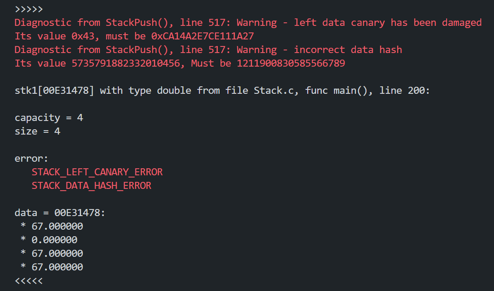

<<h2 align="center"> Stack </h2>

---

#### table of contents

* [overview](#overview)
* [features](#features)
* [demonstration](#demonstration)
* [option management](#usage)
* [used tools](#libraries)
* [to do](#todo)

---

#### overview

This library contains basic functions for work with stack. Among the functions designed for direct invocation by the user: ___StackInit___, ___StackDestroy___, ___StackPush___, ___StackPop___, ___StackVerify___, ___StackDiagnoseError___, StackDump. Functions that modify the stack control error. ___StackPush___ and ___StackPop___ return one of the following values characterizing the success of execution: ___SUCCESS___, ___FATAL_ERROR___, special value ___OVERFLOW___ or ___VACUUM___ depending on function. Value ___FATAL_ERROR___ is returned when ___StackVerify___ detects fatal violations in the stack structure that prevent stack operations. you can determine the exact error by checking the ___.error___ field of stack structure after receiving a ___FATAL_ERROR___. Value ___OVERFLOW___ means that it is impossible to expand the stack capacity, in that case the ___StackPush___ operation not be performed. Value ___VACUUM___ means that stack is empty, in that case the ___StackPop___ operation not be performed. ___SUCCESS___ mean that indicates the successful execution of a stack operation.

---

#### features

* The program have debug mode for printing reports of function verify to file
* The program have canary protect mode in which canaries are created an their integrity is monitored.
* The program have hash protect mode in which hash is calculated and its immutability is monitored.

---

#### demonstration

* __the canary and hash protection triggered in debug mode__

---

#### option management

__launch__
User has to include ___Stack.c___ to your program on __C__ language.

__program options__
* define macro ___DEBUG___ before including to switch on debug mode.
* define macro ___CANARY_PROTECTION___ before including to switch on canary protection mode.
* define macro ___CANARY_PROTECTION___ before including to switch on canary protection mode.

---

#### used tools

__libraries__
The following __C/C++__ libraries were used in the program

* __stdio.h__
for basic functions (_printf_, _fopen_, etc.)
* __stdlib.h__
for basic functions (_realloc_)
* __math.h__
for mathematical operations (_pow_)
* __assert.h__
for debug (_assert_)

----

#### to do

* Checks for dynamic memory pointers based on heap management functions.

